<!-- GRAPH -->

<a href="https://github.com/yaqzans/WT_Fall-25-26_Project"><picture><source media="(prefers-color-scheme: dark)" srcset="header/0-dark.svg"></picture></a><a href="https://github.com/yaqzans/WT_Fall-25-26"><picture><source media="(prefers-color-scheme: dark)" srcset="header/1-dark.svg"></picture></a><a href="https://github.com/yaqzans/HTML-CSS-JS-Practise"><picture><source media="(prefers-color-scheme: dark)" srcset="header/2-dark.svg"></picture></a><a href="https://github.com/yaqzans/TicTacToeInfinity"><picture><source media="(prefers-color-scheme: dark)" srcset="header/3-dark.svg"></picture></a><a href="https://github.com/yaqzans/2D-Parking-Game"><picture><source media="(prefers-color-scheme: dark)" srcset="header/4-dark.svg"></picture></a><a href="https://github.com/yaqzans/who-should-count-more"><picture><source media="(prefers-color-scheme: dark)" srcset="header/5-dark.svg"></picture></a><a href="https://github.com/yaqzans/cvpr-two-stage-vehicle-recognition"><picture><source media="(prefers-color-scheme: dark)" srcset="header/6-dark.svg"></picture></a><a href="https://github.com/yaqzans/ids-sarcasm-detection"><picture><source media="(prefers-color-scheme: dark)" srcset="header/7-dark.svg"></picture></a><a href="https://github.com/yaqzans/oshudbot"><picture><source media="(prefers-color-scheme: dark)" srcset="header/8-dark.svg"></picture></a><a href="https://github.com/yaqzans/markdown-converter-app"><picture><source media="(prefers-color-scheme: dark)" srcset="header/9-dark.svg"></picture></a>

<!-- /GRAPH -->

Final-year CSE student at AIUB, Dhaka, concentrating in computational theory. I work across ML, computer vision, NLP and graph theory, and lately most of my time goes into medical imaging. The part I actually care about is whether a result holds up: conformal guarantees, leakage-safe splits, controls that try to kill the finding before I believe it.

Looking for ML, data or research roles, and planning a masters in 2027.

### papers

- **Gesture Controlled Robotic Hand Designed for Enhancing Industrial Automation and Innovation**, IEEE QPAIN 2026. second and corresponding author. [doi](https://doi.org/10.1109/QPAIN69676.2026.11545528)
- **Development of a Simulated Blood-Like Solution for Medical Experiments**, Analytical Chemistry Letters 15(4), 2025. [doi](https://doi.org/10.1080/22297928.2025.2533331)
- **Evaluating the Performance of Agile-Waterfall Integrated Approaches in Large Scale Engineering Projects in Bangladesh**, IEOM Bangladesh 2025. [doi](https://doi.org/10.46254/BA08.20250467)
- **A Hybrid Human-AI Model for Sustainable Innovation in Media and Animation**, ICCTASS 2025

### stack

`Python` `PyTorch` `scikit-learn` `OpenCV` `R` `SQL` `C++` `Java` `JavaScript` `PHP` `Docker` `LaTeX` `ESP32`

### bits

- CGPA 3.95 / 4.00, Dean's List twice, ongoing academic scholarship
- IELTS Academic 8.0
- represented AIUB at a U.S. Embassy AI workshop and a UNDP roundtable

the graph up top is drawn by <a href="make_header.py">make_header.py</a>. every node links to its repo, every edge is something the two repos actually share, and χ(G) is checked by brute force.
