<picture>
  <source media="(prefers-color-scheme: dark)" srcset="header-dark.svg">
  
</picture>

CSE undergrad at AIUB. I mostly work on ML for medical imaging, and I care a lot more about whether a number is real than whether it is high. Conformal guarantees, leakage-safe splits, that kind of thing.

```
deg(audit harness) = 6      most of my thesis runs through it
deg(fractional χ)  = 1      a graph-theory project, drawn as a leaf
χ(G)               = 3      checked by brute force, not eyeballed
```

### public nodes

| | |
|---|---|
| [**oshudbot**](https://github.com/yaqzans/oshudbot) | Bangla medicine lookup for Bangladesh. 21,714 brands, no model, no API key |
| [**vehicle recognition**](https://github.com/yaqzans/cvpr-two-stage-vehicle-recognition) | YOLO26n boxes, ConvNeXt-Tiny relabels every crop. Bangladeshi roads, RSUD20K |
| [**who should count more**](https://github.com/yaqzans/who-should-count-more) | does weighting educated votes elect the better candidate? play with it |
| [**tictactoe ∞**](https://github.com/yaqzans/TicTacToeInfinity) | 4 pieces each, then you have to move them. has a bot |
| [**markdown converter**](https://github.com/yaqzans/markdown-converter-app) | PDF, Word, PowerPoint, Excel to clean Markdown. one exe |

The grey nodes up top are thesis work that is still private. They will turn bold when they go public.

<sub>header is generated by <a href="make_header.py">make_header.py</a>, edit the node and edge lists and rerun it</sub>
