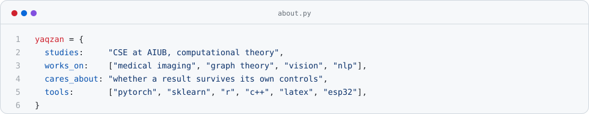
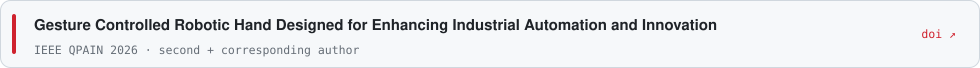
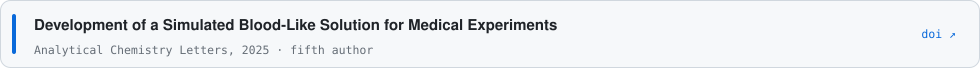
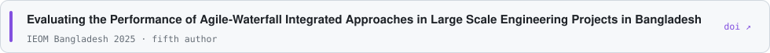

<!-- generated by make_profile.py, edit that and rerun -->

<a href="https://github.com/yaqzans/Bus-Management-System"><picture><source media="(prefers-color-scheme: dark)" srcset="assets/g0-dark.svg"></picture></a><a href="https://github.com/yaqzans/WT_Fall-25-26_Project"><picture><source media="(prefers-color-scheme: dark)" srcset="assets/g1-dark.svg"></picture></a><a href="https://github.com/yaqzans/Pink-Calculator"><picture><source media="(prefers-color-scheme: dark)" srcset="assets/g2-dark.svg"></picture></a><a href="https://github.com/yaqzans/HTML-CSS-JS-Practise"><picture><source media="(prefers-color-scheme: dark)" srcset="assets/g3-dark.svg"></picture></a><a href="https://github.com/yaqzans/WT_Fall-25-26"><picture><source media="(prefers-color-scheme: dark)" srcset="assets/g4-dark.svg"></picture></a><a href="https://github.com/yaqzans/Productivity-Manager"><picture><source media="(prefers-color-scheme: dark)" srcset="assets/g5-dark.svg"></picture></a><a href="https://github.com/yaqzans/TicTacToeInfinity"><picture><source media="(prefers-color-scheme: dark)" srcset="assets/g6-dark.svg"></picture></a><a href="https://github.com/yaqzans/who-should-count-more"><picture><source media="(prefers-color-scheme: dark)" srcset="assets/g7-dark.svg"></picture></a><a href="https://github.com/yaqzans/2D-Parking-Game"><picture><source media="(prefers-color-scheme: dark)" srcset="assets/g8-dark.svg"></picture></a><a href="https://github.com/yaqzans/cvpr-two-stage-vehicle-recognition"><picture><source media="(prefers-color-scheme: dark)" srcset="assets/g9-dark.svg"></picture></a><a href="https://github.com/yaqzans/ids-sarcasm-detection"><picture><source media="(prefers-color-scheme: dark)" srcset="assets/g10-dark.svg"></picture></a><a href="https://github.com/yaqzans/markdown-converter-app"><picture><source media="(prefers-color-scheme: dark)" srcset="assets/g11-dark.svg"></picture></a><a href="https://github.com/yaqzans/oshudbot"><picture><source media="(prefers-color-scheme: dark)" srcset="assets/g12-dark.svg"></picture></a>

<a href="https://www.linkedin.com/in/shamvi-md-abdullah-b42a321a6/"><picture><source media="(prefers-color-scheme: dark)" srcset="assets/link0-dark.svg"></picture></a> &nbsp;<a href="https://scholar.google.com/citations?user=DwskOfEAAAAJ&hl=en"><picture><source media="(prefers-color-scheme: dark)" srcset="assets/link1-dark.svg"></picture></a> &nbsp;<a href="https://orcid.org/0009-0005-9717-9426"><picture><source media="(prefers-color-scheme: dark)" srcset="assets/link2-dark.svg"></picture></a> &nbsp;<a href="mailto:shamvi.abdullah@gmail.com"><picture><source media="(prefers-color-scheme: dark)" srcset="assets/link3-dark.svg"></picture></a>

<picture><source media="(prefers-color-scheme: dark)" srcset="assets/about-dark.svg"></picture>

### papers

<a href="https://doi.org/10.1109/QPAIN69676.2026.11545528"><picture><source media="(prefers-color-scheme: dark)" srcset="assets/paper0-dark.svg"></picture></a>

<a href="https://doi.org/10.1080/22297928.2025.2533331"><picture><source media="(prefers-color-scheme: dark)" srcset="assets/paper1-dark.svg"></picture></a>

<a href="https://doi.org/10.46254/BA08.20250467"><picture><source media="(prefers-color-scheme: dark)" srcset="assets/paper2-dark.svg"></picture></a>

<picture><source media="(prefers-color-scheme: dark)" srcset="assets/paper3-dark.svg"></picture>

the graph is drawn by <a href="make_profile.py">make_profile.py</a> from my public repos. each edge is something the two repos actually share, and χ(G) is checked by brute force.
